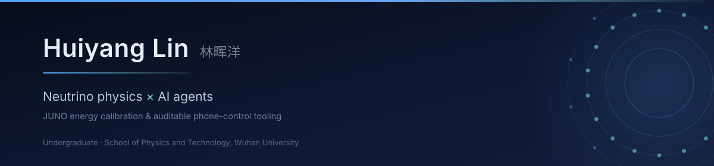

 

## Research / 科研工作

### [juno-acu-energy-calibration-pipeline](https://github.com/Paul-Lin-wj/juno-acu-energy-calibration-pipeline)

`Python` · JUNO ACU gamma-source calibration pipeline — **EDM → E_true = f(E_rec)**

JUNO（江门中微子实验）ACU 自动刻度单元伽马源刻度数据的处理流水线。覆盖从 EDM 到
`E_true = f(E_rec)` 的完整物理链路：波形与事例重建、26B 能量修正、事例挑选、
物理 QA、峰位拟合与非线性全局拟合。刻度源覆盖 **Ge68 / Cs137 / Mn54 / Co60 / K40**
五种单能源，以及 AmC 关联对三峰（n-H / n-12C / O16）。

子项目 / Sub-projects：

#### [standalone_esd2npz](https://github.com/Paul-Lin-wj/standalone_esd2npz)

`Python` · Auditable EDM/ESD → NPZ pipeline with per-run provenance

把 JUNO ReProd26B 刻度数据从 EDM/ESD 一路处理成 fitter 可直接使用的
`Run{N}_SelectionResult.npz`（OMILREC 重建能量/顶点 + 26B Finalcorrection +
单事件源 EFV 挑选）。每次运行自动留档**代码快照（含 sha256）**、
**全部挑选 cut 条件**、物理 QA 图与结束完整性审计——结果逐位可溯源，
代码变更与物理结论的对应关系被完整记录。代码溯源见 `PROVENANCE.md`。

#### [juno_calibration_acu_gamma_source](https://github.com/Paul-Lin-wj/juno_calibration_acu_gamma_source)

`Python` · Standalone JUNO energy spectrum fitter

基于 JUNO MC 模板的最小二乘（χ²）能量谱拟合工具，支持多种刻度源的能量谱分解与
峰位提取。含缓存优化的 Fast 版拟合器、Ge68 / Cs137 / Co60 / Mn54 / K40 / O16 /
Po214 各源独立拟合器，以及无 C++ 扩展依赖的 `smx_ana` 纯 Python 实现。

### [jbench_plank2018](https://github.com/Paul-Lin-wj/jbench_plank2018)

`Python` · Planck 2018 CMB benchmark for auditing an AI agent's physics reasoning

用宇宙学参数推断来测 AI agent 的物理推理能力。Generator 生成 Planck 2018 风格的
模拟观测：CAMB 理论谱 + 银河前景 + 仪器噪声，覆盖 30–353 GHz 七个频段，含波束卷积。
参数在 Planck 2018 ±3σ 内**均匀随机采样**，防止 agent 背题；真值与 agent 严格隔离，
由评分系统独占。每次评测自动输出带诊断图的 HTML 报告。

---

## Also building / 其他

Agent 与工具链方向的部分工作：

- **[pi-phone-control](https://github.com/Paul-Lin-wj/pi-phone-control)** — Android 手机操控 agent 扩展：受约束的工具面 + 多层安全防线 + 红队三轮实测（配套 [android-task-banner](https://github.com/Paul-Lin-wj/android-task-banner)）
- **[co-scientist-on-claude-code](https://github.com/Paul-Lin-wj/co-scientist-on-claude-code)** — Google Co-Scientist 多智能体科学发现系统的 Claude Code 复现：7 个专门智能体（Supervisor / Generation / Reflection / Ranking / Proximity / Evolution / MetaReview）组成"文献综述 → 假设生成 → 同行评审 → Elo 锦标赛排名 → 假设进化 → 元评审"循环
- **[TransformerWiki](https://github.com/Paul-Lin-wj/TransformerWiki)** — Transformer 模型优化的结构化知识库，打包为 Claude Code skill：注意力机制、训练策略、推理服务、量化、kernel 级优化与 serving 框架，含自动生成的交叉引用索引与混合版本声明注册表
- **[CS_switch](https://github.com/Paul-Lin-wj/CS_switch)** — Claude Science 接入任意 OpenAI 兼容端点的 Linux CLI

---

## Contact

**Email** · `muad.dib.lin@gmail.com`

个人主页 / Personal site · **https://paul-lin-wj.github.io**
